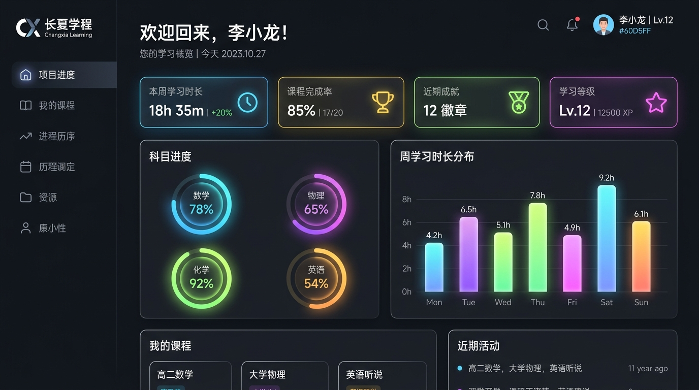
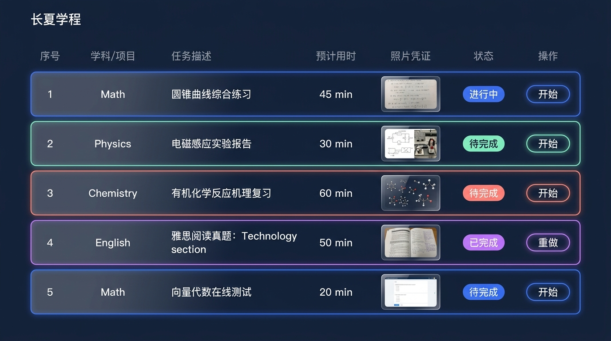
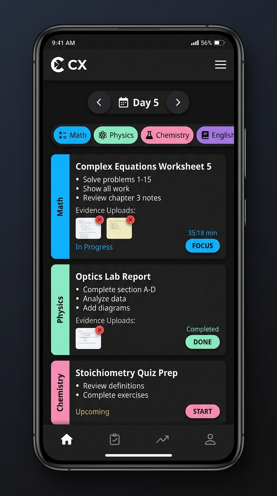
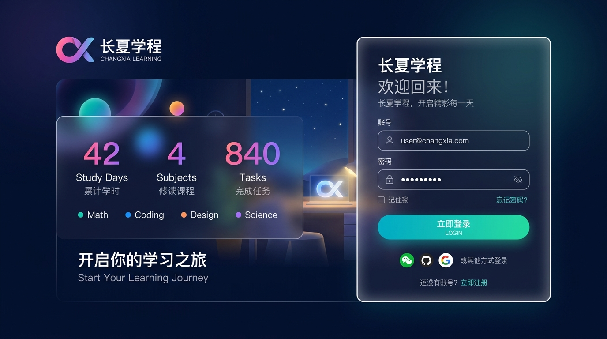
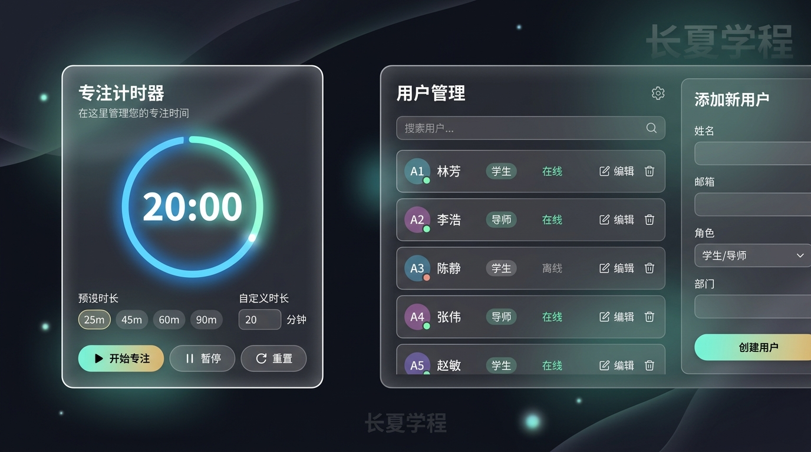

# 长夏学程 Web 系统全套高奢界面设计原型 (第二版)

根据您的反馈，为了彻底消除旧版任务列表配色稍显“土气”的问题，我们重新设计了**任务列表界面（界面二）**，使其在色彩、质感和整体格调上与**登录页面（界面四）**完全看齐。

---

## 1. 界面原型效果展示

我们为系统的每个主要界面和弹窗均生成了对应的高保真设计：

````carousel
### 界面一：极精细化数据总览 (Premium Dashboard Overview)
总览面板采用深色科幻风格背景，数据指标卡配备半透明玻璃渐变边缘与精细小图标。科目进度部分升级为**渐变双环形进度指示器 (Radial Progress Gauges)**，周学习时长分布则使用**圆角发光柱状图 (Neon Bar Charts)**，带来科技美学与数据呼吸感。



<!-- slide -->
### 界面二：高档登录页同款任务列表 (Login-matching Task List) - 【已重构】
采用与登录页完全一致的深夜蓝背景。每一行都是一块精致的**毛玻璃卡片**，四周环绕着对应学科的主题霓虹发光边框（Math-科技蓝、Physics-薄荷绿、Chemistry-珊瑚橙粉、English-典雅紫）。文字全部改用清透的白字与灰字，状态指示灯与控制按钮均为圆角发光胶囊形态，整体视觉极为通透、奢华且充满现代感。



<!-- slide -->
### 界面三：手机端自适应界面 (Mobile Viewport)
针对手机屏幕专门优化的移动端界面。顶部为便捷的日期切换条（Day 5）与折叠菜单，下方为胶囊式的学科快速筛选器，任务列表以流畅卡片流形式垂直排列，左侧带有学科主题色侧条（Math/Physics/Chemistry），卡片内集成一键专注按钮、上传缩略图预览与状态按钮，完美适配单手操作。



<!-- slide -->
### 界面四：系统登录页 (Login Page)
登录页左侧展示学习计划的核心事实统计卡片（42天、4个学科、840个任务）和多巴胺色块，右侧为半透明毛玻璃质感的登录表单，输入框内嵌图标，登录按钮支持微发光和极速按压反馈。



<!-- slide -->
### 界面五：功能弹窗集 (Modals Dialog)
*   **左侧：专注计时器弹窗 (Focus Timer)** —— 中间为大尺寸 of SVG 环形进度条和 20:00 倒计时，底部分别为建议时长快捷选择、自定义时长输入和三级控制按钮。
*   **右侧：用户管理弹窗 (User Management)** —— 管理员专属面板，左侧为现有账号卡片列表（包含角色徽章 and 在线状态），右侧为简洁的“添加新用户”表单。


````

---

## 2. 配色与重构规范 (深色登录同款)

在代码重构阶段，我们将摒弃原先偏淡、偏土的淡灰底色和灰色边框，全面采用深色模式：

```css
:root {
  /* 基础深夜背景色值 */
  --bg-dark-midnight: #0b0f19;
  --bg-dark-panel: #17233b;
  --bg-dark-card: rgba(255, 255, 255, 0.04);
  --border-glass: rgba(255, 255, 255, 0.08);

  /* 多巴胺发光霓虹色值 */
  --neon-math: 0 0 15px rgba(0, 114, 255, 0.35), 0 0 2px rgba(0, 114, 255, 0.7);
  --neon-physics: 0 0 15px rgba(67, 198, 170, 0.35), 0 0 2px rgba(67, 198, 170, 0.7);
  --neon-chemistry: 0 0 15px rgba(255, 93, 158, 0.35), 0 0 2px rgba(255, 93, 158, 0.7);
  --neon-english: 0 0 15px rgba(140, 112, 237, 0.35), 0 0 2px rgba(140, 112, 237, 0.7);
}
```

*   **对比度增强**：表格中的文字全部采用明亮的纯白（`#ffffff`）和高级浅灰（`#a0aec0`），避免了原有的深灰字在深色背景下看不清的问题。
*   **主体统一性**：由于任务列表和总览都共享这一套高级的深色基调，页面在切换时不会有突兀的色彩明暗变化，与登录页完美交融。
